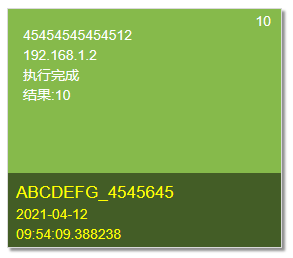

# 消息卡片

#### 介绍
可用于消息记录的卡片样式<br>


#### 软件架构
```
.git
blockinformarion\    用于渲染卡片样式
bootstrapstatic\       bootstrap包
jquery\                     jquery包
animate\               
docs\                文档
.gitignore
index.html           示例网页
LICENSE
README.md
```
#### 下载教程
下载[blockinformarion_v1.1.0.css](blockinformarion/blockinformarion_v1.1.0.css)或[blockinformarion_v1.1.0.min.css](blockinformarion/blockinformarion_v1.1.0.min.css)<br>
[blockinformarion_v1.1.0.js](blockinformarion/blockinformarion_v1.1.0.js)或[blockinformarion_v1.1.0.min.js](blockinformarion/blockinformarion_v1.1.0.min.js)<br>
推荐在生产环境使用blockinformarion_v1.1.0.min.css和blockinformarion_v1.1.0.min.js<br>
如果想下载其他版本请在[此处](blockinformarion/)下载
#### 使用说明
将文件拷贝到工作目录并解压<br>
在网页\<head>\</head>中插入以下文字
```
<link href="blockinformarion/blockinformarion.css" rel="stylesheet" />
```
并在网页\<body>\</body>结尾插入以下文字
```
<script src="blockinformarion/blockinformarion.js"></script>
```
并在需要使用卡片位置,使用以下结构进行编写,其中“[]”内容可修改,包括“[]”
```
<div class="wd">
	<div class="picture">
		<div class="top-text">
			<div class="top-right-text">
				<p>[10]</p>
			</div>
			<div class="top-button-text">
				<p>[45454545454512]</p>
				<p>[192.168.1.2]</p>
				<p>[执行完成]</p>
				<p>[结果:10]</p>
			</div>
		</div>
		<div class="text">
			<div class="title">
				<p>[ABCDEFG_4545645]</p>
			</div>
			<p>[2021-04-12]</p>
			<p>[09:54:09.388238]</p>
		</div>
	</div>
</div>
```
#### 个性化
如果对默认样式不喜欢可以进行修改，具体请看 [**样式个性化**](docs/v1.1.0/individualization.md)
#### 参与贡献
对代码不熟悉？具体请看 [代码讲解](docs/v1.1.0/code_explanation.md)
